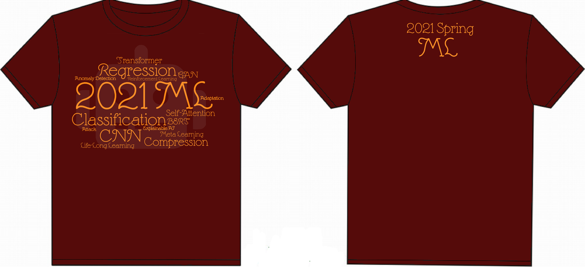

# Machine Learning 2022-2023

Machine Learning (NTU EE 5184, Spring 2021-23)

Instructor: Hung-yi Lee

Course Website : (https://speech.ee.ntu.edu.tw/~hylee/ml/2023-spring.html)

---

## Homeworks
|#|Homework|Version|Public score|Private Score|Score|
|-|-|-|-|-|-|
|1|Regression|2023|0.80653|0.83223|9
|2|Classification|2023|0.83168| 0.83236|10 
|3|CNN|2023|0.88600|0.89333|10
|4|Self-Attention|2023|0.94875|0.95075|10
|5|Transformer|2023|20.995|20.995|8
|6|GAN, Diffusion|2022, 2023|NA|NA|10
|7|BERT|2022, 2023|0.8|0.85157|10.5
|8|Anomaly Detection|2023|0.90118|0.89286|10.5
|9|Explainable AI|2021,2022,2023|NA|NA|9.7
|10|Attack|2023|0.010|0.010|10.5
|11|Adaptation|2022|0.78806|0.78744|10
|12|RL|2023|287|NA|10.5
|13|Compression|2022|0.75686|0.75493|9.5
|14|Life-Long Learning|2023|NA|NA|10
|15|Meta Learning|2023|NA|NA|10

Total Score:
I referred to other people's codes, blogs, and ChatGPT during the completion of my assignment. I would like to express my gratitude here. And it is worth noticing that ince there's not any TA or instructor during the self-learning period,  I myself gave full marks to all my reports, so my results are fair to a certain extent. Of course, I completed this course out of my interest in the field of machine learning and my admiration for Professor Hung Yi Lee. I need to express my gratitude to Professor Lee. Moreover, the open source code has been approved by Professor Lee. And I am really looking forward to getting a T-shirt like this:

